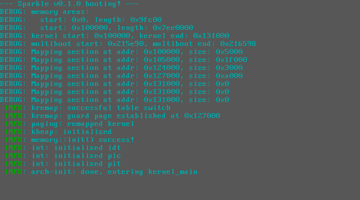

 [](https://deps.rs/repo/github/sparkle-os/sparkle)

# ✨sparkle✨



## building
system prereqs/deps:
* qemu
* grub (`grub-mkrescue` is used to generate the bootable `.iso`)
  * `xorriso`, used by `grub-mkrescue` to build the `.iso`
  * you might also have to install `mtools` so that `grub-mkrescue` doesn't attempt to build an EFI image
  * additionally, you'll probably need `grub-pc-bin`. again, this is modulo a bunch of things, and on, eg, Arch, installing `grub` should pull this in; on Ubuntu, if you're grub-booting off of EFI, you probably don't.

```
$ cargo install cargo-xbuild
$ make
```

to run in an emulator:
```
$ make run
```
